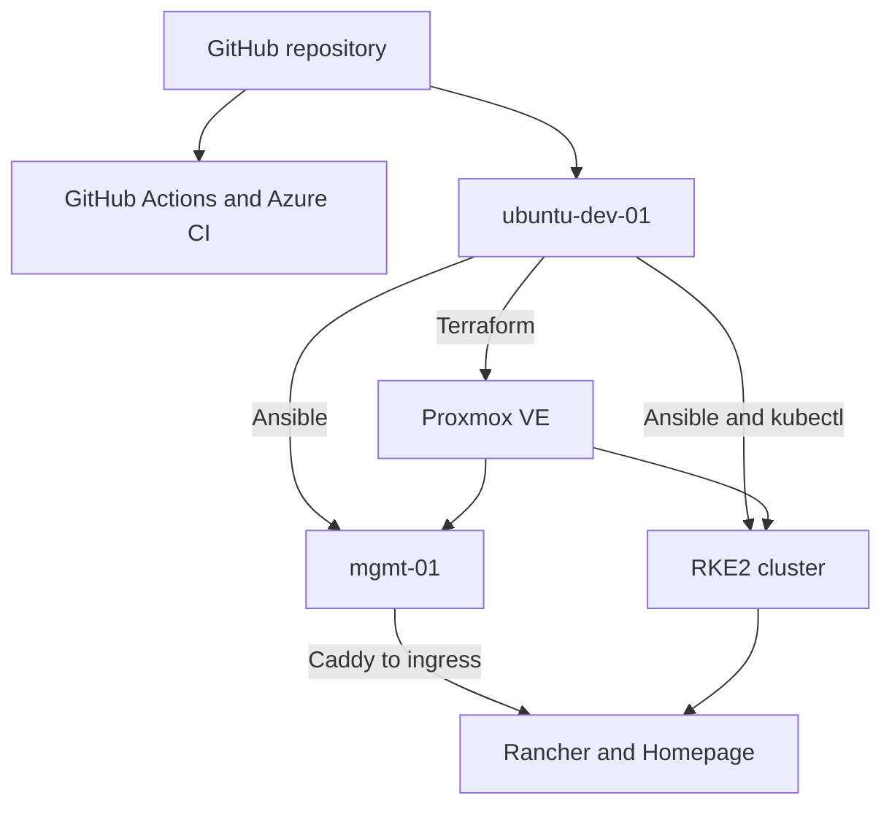

# Barou Platform

A self-hosted DevOps learning platform built with Proxmox VE, Terraform, Ansible and RKE2. The project documents both platform automation and the operational work needed to keep it running.

> Status: September 2026. Gitea and Jenkins have been retired. GitLab and GitLab Runner are the next delivery-platform phase and are not deployed yet. Kubernetes and the remaining lab services must stay running during that transition.

This is a learning and portfolio environment on one physical host. It does not provide production availability or a production SLA.

## What This Platform Demonstrates

- Declarative VM provisioning through a reusable Terraform module.
- Linux configuration, host security and network services through Ansible roles.
- Operation of a two-node RKE2 cluster with Cilium, Rancher and Homepage.
- Internal DNS, HTTPS routing and private remote access.
- Shared infrastructure-code validation in GitHub Actions and Azure Pipelines.
- Azure foundations and a separate workload identity verification workflow.
- Troubleshooting, reviewable Git changes and documented operational limits.

## Current Architecture

Terraform manages infrastructure; Ansible configures hosts; Kubernetes manifests describe workloads. Deployment to the homelab remains an explicit operator action.

The diagram represents the current platform. GitLab, Argo CD and the planned observability stack are excluded because they are not deployed.

## Infrastructure Inventory

| System | Role | Management |
|---|---|---|
| HP EliteDesk / `pve` | Physical host and Proxmox VE | Proxmox administration |
| `ubuntu-dev-01` | VS Code Remote SSH and automation entry point | Git, Terraform, Ansible and kubectl |
| `ubuntu-tf-01` | Ubuntu automation target | Terraform and Ansible |
| `mgmt-01` | DNS, Caddy and Tailscale subnet routing | Terraform and Ansible |
| `k8s-cp-01` | RKE2 control plane and embedded etcd | Terraform and Ansible |
| `k8s-worker-01` | RKE2 worker | Terraform and Ansible |

See [Infrastructure Overview](docs/infrastructure-overview.md) for VM IDs, addresses, resource allocations and ownership.

## Automation Model

| Layer | Configuration | Responsibility |
|---|---|---|
| Proxmox infrastructure | `infrastructure/proxmox/` | VM lifecycle, Cloud-Init, CPU, memory and networking |
| Azure infrastructure | `infrastructure/azure/` | Azure foundations and environment configuration |
| Host configuration | `configuration/ansible/` | Linux baseline, firewalls, management services and RKE2 |
| Kubernetes workloads | `kubernetes/platform/` | Platform manifests and operational documentation |
| Validation | `scripts/validate.sh` | Shared Terraform and Ansible checks |

Proxmox Terraform state is local and excluded from Git. Azure uses its own Azure Storage backend; its state and workload identity work are separate from the Proxmox backend. Do not treat all Terraform roots as sharing one state configuration.

The Proxmox VM module retains the recorded state migration in `moved.tf`. Refactoring resource addresses must preserve existing infrastructure unless replacement is intentional and reviewed.

Ansible roles manage the Linux baseline, security, Docker where required, Tailscale routing, internal DNS, Caddy, and RKE2. The Gitea and Jenkins roles and playbooks have been removed. RKE2 nodes use containerd supplied by RKE2.

## Kubernetes Platform

The cluster has one control-plane node with embedded etcd and one worker. Its components include Cilium, CoreDNS, ingress-nginx and Metrics Server. Rancher provides cluster management; Homepage provides read-only Kubernetes and Proxmox visibility plus service links.

The Gitea and Jenkins Homepage widgets, environment-variable references and corresponding Secrets have been removed. GitLab will be added only after its deployment and access model have been verified.

See [Kubernetes Platform](docs/architecture/kubernetes-platform.md) and [Homepage](kubernetes/platform/homepage/README.md).

## Networking and Access

Internal services use `lab.barouconsulting.nl`. DNS resolves the application names to `mgmt-01` at `192.168.178.106`. Caddy terminates HTTPS and routes Proxmox directly to its API/web endpoint, and Rancher and Homepage through the Kubernetes ingress at `192.168.178.111:80`.

Remote administration uses Tailscale and VS Code Remote SSH into `ubuntu-dev-01`. Its current LAN address is `192.168.178.101`. The management gateway and Kubernetes nodes have static LAN addresses configured through Terraform.

CoreDNS forwards public queries to `1.1.1.1` and `9.9.9.9`, and queries for the internal zone to `mgmt-01`. Caddy's public root certificate must be trusted by administrator clients; its CA private key must remain protected.

## CI Validation

GitHub remains the public source repository and portfolio. GitHub Actions and the root `azure-pipelines.yml` reuse `scripts/validate.sh` for:

- Terraform formatting, initialization with the backend disabled and validation;
- Ansible syntax checks and ansible-lint with pinned dependencies.

These validation jobs do not deploy to the homelab. The separate Azure workload identity verification pipeline authenticates to Azure and checks access; it must not be confused with credential-free static CI. See [CI/CD Architecture](docs/ci-cd.md).

GitLab CI/CD is planned. Existing GitHub and Azure validation remains in place during the transition.

## Security Model

- Tailscale provides private remote access.
- Ansible manages SSH hardening and host firewall rules.
- Caddy provides internal HTTPS endpoints.
- Secrets, kubeconfigs and Terraform state are excluded from Git.
- Homepage uses a dedicated Kubernetes ServiceAccount and read-only Proxmox API access.
- Pull requests and required checks govern changes to `main`.
- Deployment credentials are kept separate from static validation jobs.

External secret management, credential rotation, certificate verification improvements and recovery testing remain development areas.

## Platform Screenshots

The existing images capture earlier platform milestones. They are historical evidence, not an inventory of currently deployed services; the Homepage and Proxmox images may still show retired VMs or widgets. The previous architecture PNG also predates the retirement. The current diagram and inventory above take precedence.

| Capture | Link |
|---|---|
| Homepage | [Dashboard screenshot](docs/assets/screenshots/homepage-dashboard.png) |
| Proxmox | [Infrastructure screenshot](docs/assets/screenshots/proxmox-infrastructure.png) |
| Rancher | [Cluster screenshot](docs/assets/screenshots/rancher-cluster.png) |
| Retired Jenkins milestone | [Historical pipeline screenshot](docs/assets/screenshots/jenkins-pipeline.png) |
| GitHub Actions | [Validation screenshot](docs/assets/screenshots/github-actions-validation.png) |
| Azure Pipelines | [Validation screenshot](docs/assets/screenshots/azure-devops-validation.png) |

## Documentation

| Document | Purpose |
|---|---|
| [Infrastructure Overview](docs/infrastructure-overview.md) | VM inventory, capacity and operating commands |
| [Architecture](docs/architecture.md) | Current architecture, responsibilities and target state |
| [Kubernetes Platform](docs/architecture/kubernetes-platform.md) | Cluster topology, networking and verification |
| [CI/CD Architecture](docs/ci-cd.md) | Existing CI and GitLab migration sequence |
| [Developer Workflow](docs/developer-workflow.md) | VS Code, Git, validation and pull requests |
| [Management Platform](docs/management-platform.md) | Tailscale, DNS, Caddy and gateway recovery |
| [RKE2 Runbook](docs/runbooks/rke2.md) | RKE2 operations |
| [Rancher Runbook](docs/runbooks/rancher.md) | Rancher operations |
| [Kubernetes Troubleshooting](docs/troubleshooting/kubernetes.md) | Cluster diagnostics |
| [Architecture Decisions](docs/adr) | Recorded design decisions |

## Known Limitations and Roadmap

The physical host, management gateway, control plane, etcd member and worker are single points of failure. Physical RAM is limited to 16 GB. Homepage is a dashboard, not a complete monitoring or alerting system. Proxmox remote state, off-host backups, persistent Kubernetes storage and tested disaster recovery need further work.

The next steps are:

1. Complete review and validation of the Gitea/Jenkins retirement.
2. Select and size the GitLab and Runner deployment while preserving the running cluster and remaining services.
3. Reuse the existing validation script in GitLab CI/CD before introducing deployment jobs.
4. Add controlled Terraform plan/apply workflows and finish environment-specific state and identity controls.
5. Introduce Argo CD, persistent storage, backup testing and stronger secret management.
6. Add Prometheus, Grafana and Loki as capacity permits.
7. Develop the Azure environment and compare RKE2 with AKS.

## License

This project is licensed under the [MIT License](LICENSE).
