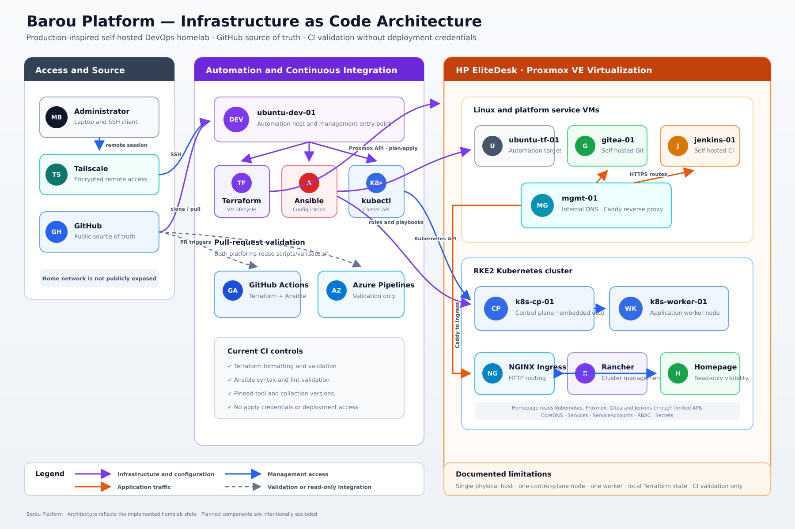
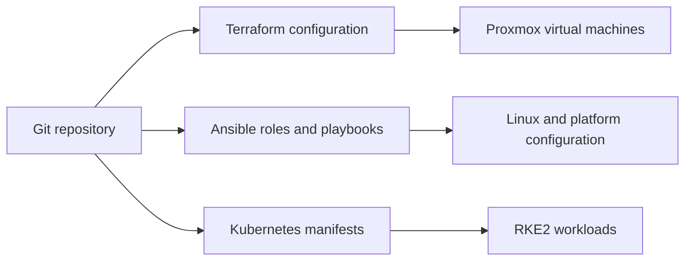
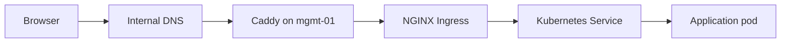
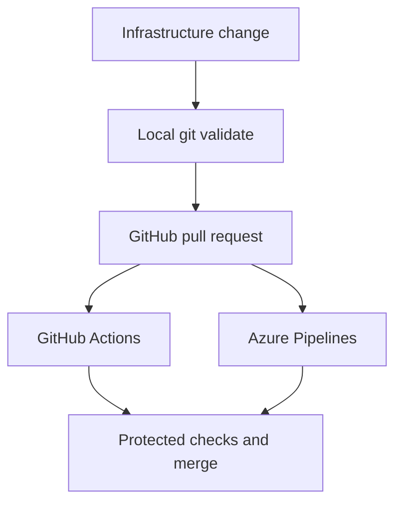
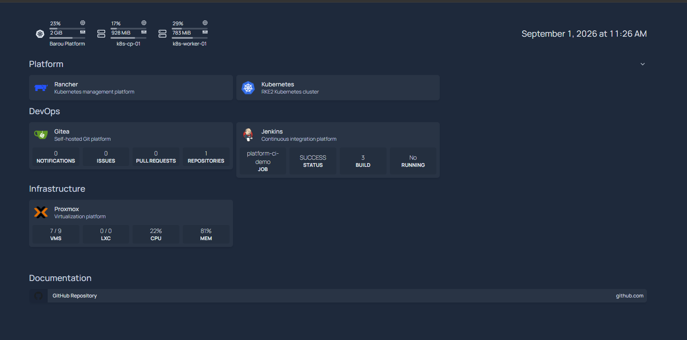
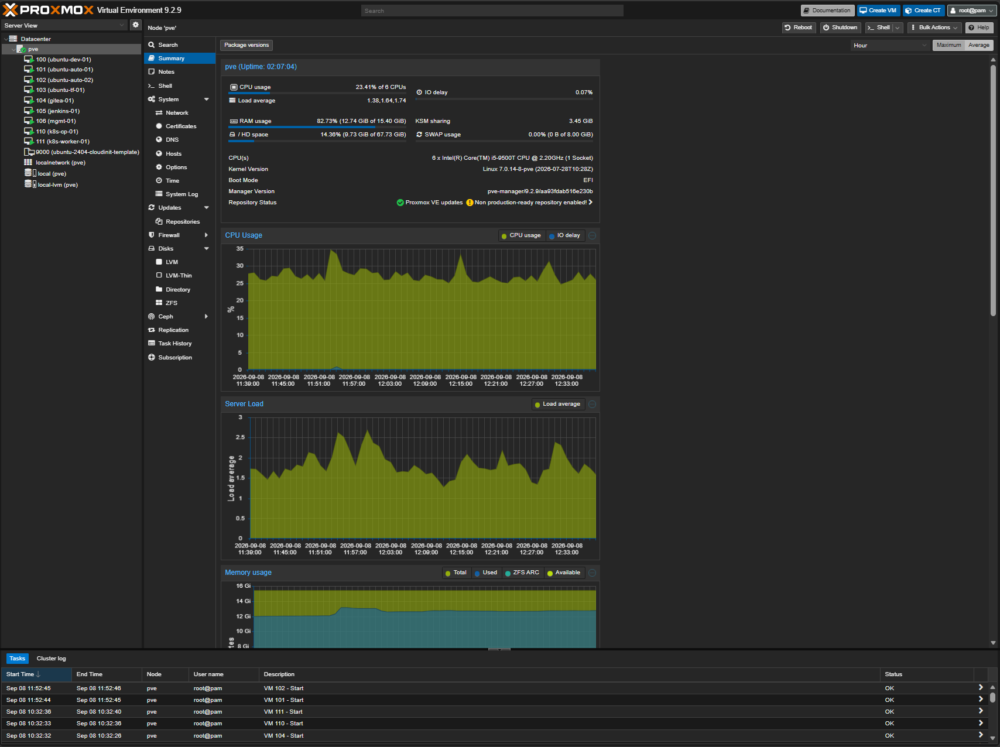
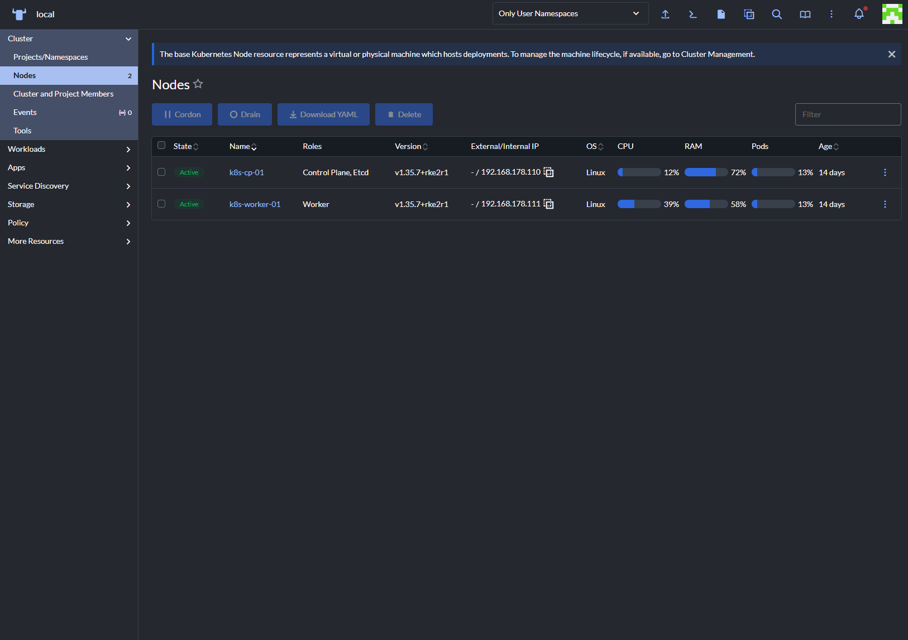
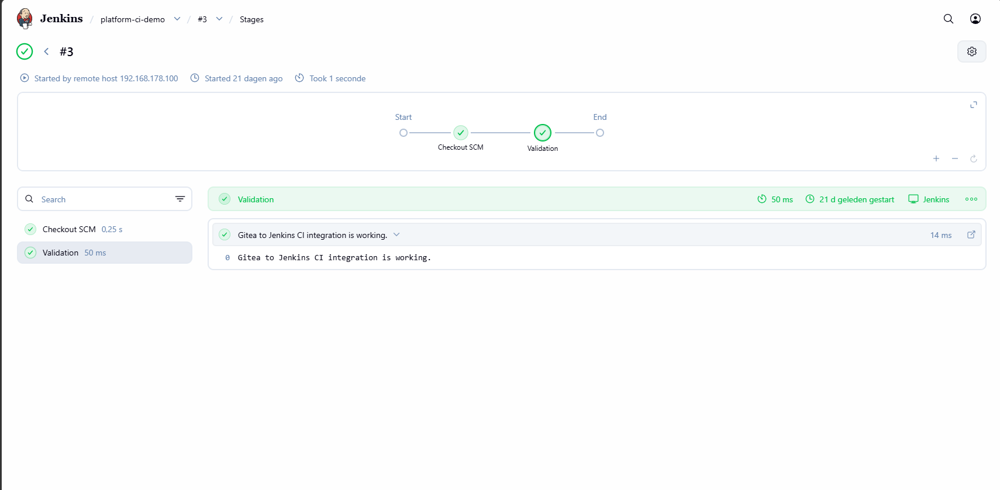
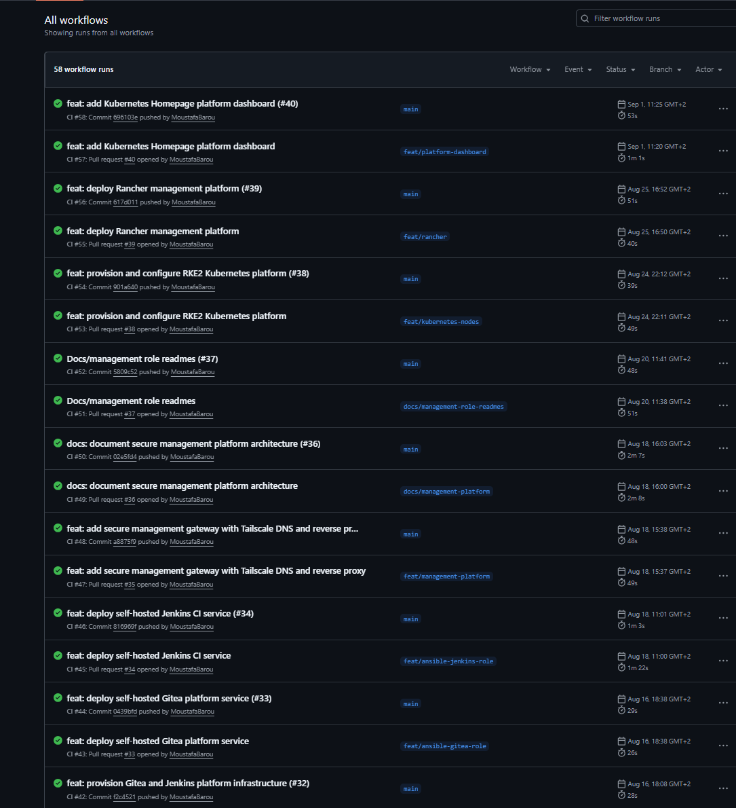
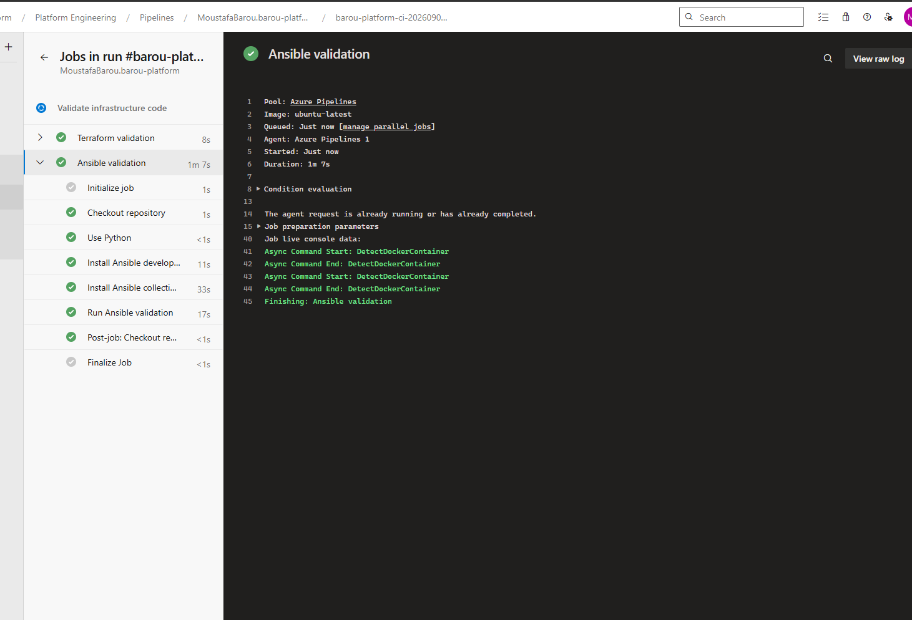

# Barou Platform

Production-inspired, self-hosted DevOps platform built to develop practical experience with Linux, Infrastructure as Code, configuration management, containers, Kubernetes, CI and platform operations.

[](https://github.com/MoustafaBarou/barou-platform/actions/workflows/ci.yml)


The platform runs on a single HP EliteDesk with Proxmox VE. Terraform provisions Ubuntu virtual machines, Ansible configures the operating systems and platform services, and RKE2 provides the Kubernetes layer. GitHub Actions and Azure Pipelines perform reproducible infrastructure-code validation.

> This is a learning and portfolio environment. It applies production-oriented engineering practices, but it is not designed to provide production availability or a production SLA.

## Table of Contents

- [What This Platform Demonstrates](#what-this-platform-demonstrates)
- [Architecture](#architecture)
- [Infrastructure Inventory](#infrastructure-inventory)
- [Automation Model](#automation-model)
- [Kubernetes Platform](#kubernetes-platform)
- [Networking and Access](#networking-and-access)
- [CI Validation](#ci-validation)
- [Security Model](#security-model)
- [Platform Screenshots](#platform-screenshots)
- [Repository Structure](#repository-structure)
- [Documentation](#documentation)
- [Known Limitations](#known-limitations)
- [Roadmap](#roadmap)

## What This Platform Demonstrates

Barou Platform brings several infrastructure disciplines together in one environment:

- provisioning virtual machines declaratively with Terraform;
- configuring Linux hosts and services with reusable Ansible roles;
- running containerized services with Docker and Docker Compose;
- operating a self-managed RKE2 Kubernetes cluster;
- exposing internal applications through DNS, reverse proxying and Kubernetes Ingress;
- validating infrastructure code locally and in two CI platforms;
- applying least-privilege access to platform integrations;
- documenting architecture, operational procedures and troubleshooting;
- managing changes through feature branches, pull requests and protected checks.

The repository is intended to show not only which tools are used, but how the components work together and how the platform is operated.

## Architecture



The diagram shows the implemented infrastructure and automation paths. Planned components such as Argo CD and the observability stack are intentionally excluded.

The environment separates infrastructure provisioning, operating-system configuration and workload orchestration:

| Layer | Technology | Responsibility |
|---|---|---|
| Virtualization | Proxmox VE | Runs the Ubuntu virtual machines |
| Provisioning | Terraform | Defines and manages VM resources |
| Configuration | Ansible | Configures Linux, security, networking and services |
| Containers | Docker | Runs self-hosted platform services |
| Orchestration | RKE2 | Schedules and manages Kubernetes workloads |
| Access | Tailscale, DNS and Caddy | Provides remote administration and HTTPS routing |
| Validation | GitHub Actions and Azure Pipelines | Validates Terraform and Ansible changes |

## Infrastructure Inventory

| System | Role | Management method |
|---|---|---|
| HP EliteDesk | Physical homelab server | Proxmox VE |
| `ubuntu-dev-01` | Administration and automation entry point | Linux, Git, Terraform, Ansible and kubectl |
| `ubuntu-tf-01` | Terraform-managed Ubuntu automation target | Terraform and Ansible |
| `gitea-01` | Self-hosted Git service | Ansible and Docker Compose |
| `jenkins-01` | Self-hosted CI service | Ansible and Docker Compose |
| `mgmt-01` | Internal DNS, Caddy reverse proxy and remote platform services | Ansible |
| `k8s-cp-01` | RKE2 control-plane and embedded-etcd node | Terraform and Ansible |
| `k8s-worker-01` | RKE2 worker and application node | Terraform and Ansible |

Detailed addresses, resource allocations and service responsibilities are documented in [Infrastructure Overview](docs/infrastructure-overview.md).

## Automation Model



### Terraform

Terraform manages the lifecycle of the Proxmox Ubuntu virtual machines. The configuration uses a reusable VM module and explicit provider-version constraints. State migrations are recorded through `moved.tf` instead of recreating existing resources.

Terraform currently uses local state. A remote backend, state locking and controlled plan/apply workflows are planned before Azure deployment automation is introduced.

### Ansible

Ansible configures the Linux hosts after the virtual machines exist. The roles cover areas such as:

- common operating-system configuration;
- SSH and firewall security controls;
- Docker installation;
- Gitea and Jenkins deployment;
- internal DNS and Caddy reverse-proxy configuration;
- RKE2 server, agent, firewall and CoreDNS configuration.

The playbooks are designed to be idempotent: running them repeatedly should preserve the same desired end state.

### Kubernetes

Kubernetes manifests define platform workloads separately from the host configuration. Namespaces, ServiceAccounts, RBAC, ConfigMaps, Deployments, Services and Ingress resources are stored in Git.

## Kubernetes Platform

The cluster uses RKE2 and currently consists of:

- one control-plane node with embedded etcd;
- one worker node;
- RKE2 CoreDNS for cluster DNS;
- RKE2 NGINX Ingress Controller;
- Rancher for Kubernetes management;
- Homepage for read-only platform visibility.

Homepage combines live information from Kubernetes, Proxmox VE, Gitea and Jenkins. Its integrations use dedicated credentials and limited access rather than administrative accounts.

The Kubernetes deployment definitions are available under [`kubernetes/platform`](kubernetes/platform).

## Networking and Access

The main application request path is:



Internal services use the `lab.barouconsulting.nl` DNS zone. Caddy provides the user-facing HTTPS endpoints and forwards Kubernetes-hosted services to the RKE2 ingress layer.

Remote administration uses Tailscale. `ubuntu-dev-01` is the controlled entry point from which the private homelab systems are managed over their LAN addresses.

CoreDNS forwards:

- public DNS queries to external resolvers;
- queries for `lab.barouconsulting.nl` to the internal DNS service on `mgmt-01`.

## CI Validation

The project uses the same validation logic locally, in GitHub Actions and in Azure Pipelines.



The central [`scripts/validate.sh`](scripts/validate.sh) script supports separate Terraform and Ansible validation targets.

Current checks include:

- Terraform formatting;
- Terraform initialization with the backend disabled;
- Terraform configuration validation;
- Ansible playbook syntax validation;
- ansible-lint using pinned development dependencies.

The current pipelines perform CI validation only. They do not have infrastructure credentials and do not run `terraform apply` or deploy to the homelab.

The design and operating model are documented in [CI/CD Architecture](docs/ci-cd.md).

## Security Model

The homelab applies the following controls:

- remote access through Tailscale instead of directly exposing SSH;
- SSH hardening and host firewall configuration through Ansible;
- HTTPS termination through Caddy;
- credentials and API tokens excluded from Git;
- integration credentials stored in Kubernetes Secrets;
- dedicated read-only Proxmox and Jenkins integration accounts;
- a dedicated Homepage ServiceAccount with limited Kubernetes RBAC;
- protected pull-request validation before changes reach `main`;
- CI pipelines without deployment credentials.

This is a homelab security model, not a complete production security baseline. Kubernetes secret encryption at rest, centralized secret management and automated credential rotation remain future improvements.

## Platform Screenshots

### Platform Dashboard

Homepage provides one read-only operational view of Kubernetes, Proxmox VE, Gitea and Jenkins.



### Proxmox Infrastructure

Proxmox VE provides the virtualization layer for the Ubuntu platform machines.



### Rancher Cluster Management

Rancher provides a management interface for the self-managed RKE2 cluster.



### Jenkins Pipeline

Jenkins is used to develop practical experience with self-hosted CI and pipeline execution.



### GitHub Actions

GitHub Actions validates pull requests against the public source repository.



### Azure Pipelines

Azure Pipelines runs the same Terraform and Ansible validation workflow using Microsoft-hosted agents.



## Repository Structure

```text
.
├── .github/
│   └── workflows/             # GitHub Actions validation
├── configuration/
│   └── ansible/               # Inventories, playbooks and reusable roles
├── diagrams/                  # Architecture diagram sources
├── docs/
│   ├── adr/                   # Architecture Decision Records
│   ├── architecture/          # Component architecture
│   ├── assets/                # Documentation images
│   ├── runbooks/              # Operational procedures
│   └── troubleshooting/       # Diagnostic procedures
├── infrastructure/
│   └── proxmox/               # Terraform configuration and VM module
├── kubernetes/
│   └── platform/              # Rancher and Homepage manifests
├── scripts/                   # Local validation and Git workflow scripts
├── azure-pipelines.yml        # Azure DevOps CI pipeline
└── README.md                  # Portfolio and platform overview
```

## Documentation

| Document | Purpose |
|---|---|
| [Infrastructure Overview](docs/infrastructure-overview.md) | Current platform, systems, network paths and responsibilities |
| [Architecture](docs/architecture.md) | Platform architecture and component relationships |
| [Kubernetes Platform](docs/architecture/kubernetes-platform.md) | RKE2 architecture and Kubernetes design |
| [CI/CD Architecture](docs/ci-cd.md) | Local, GitHub Actions and Azure Pipelines validation |
| [Developer Workflow](docs/developer-workflow.md) | Branch, validation, pull-request and merge workflow |
| [Management Platform](docs/management-platform.md) | Rancher architecture and management model |
| [RKE2 Runbook](docs/runbooks/rke2.md) | RKE2 operations, status checks and recovery |
| [Rancher Runbook](docs/runbooks/rancher.md) | Rancher access and operational checks |
| [Kubernetes Troubleshooting](docs/troubleshooting/kubernetes.md) | Layered Kubernetes diagnostic procedures |
| [Architecture Decision Records](docs/adr) | Recorded platform design decisions |

## Known Limitations

- The platform runs on one physical Proxmox host.
- The RKE2 cluster has one control-plane node and one worker node.
- Embedded etcd currently has one member.
- Terraform state is not stored in a remote backend.
- Kubernetes credentials are stored as native Secrets without external secret management.
- Homepage provides visibility but is not a complete monitoring and alerting solution.
- Central metrics, logging and alerting have not yet been implemented.
- CI validates code but does not currently perform automated deployment.
- Disaster-recovery procedures and off-host backups require further development.

These limitations are documented deliberately because understanding operational risk is part of the platform-engineering exercise.

## Roadmap

The next planned platform improvements are:

1. introduce Argo CD for GitOps-based Kubernetes delivery;
2. deploy Prometheus, Grafana and Loki for observability;
3. configure persistent storage and improve backup and recovery;
4. introduce stronger Kubernetes secret management;
5. add remote Terraform state and state locking;
6. build an approval-controlled Azure infrastructure pipeline;
7. create Azure landing-zone-style foundations;
8. compare self-managed RKE2 with Azure Kubernetes Service;
9. expand the cluster to remove control-plane and worker single points of failure.

## License

This project is licensed under the [MIT License](LICENSE).
