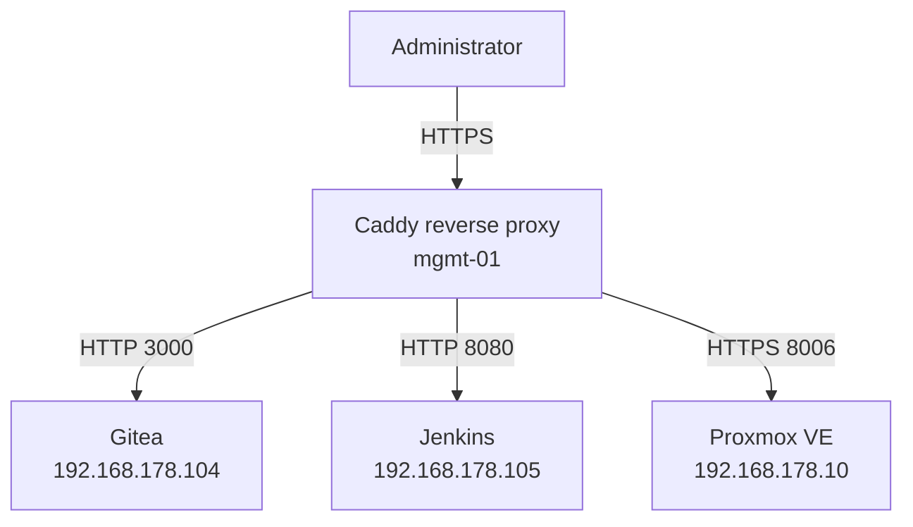

# Reverse Proxy Role

## Overview

The `reverse_proxy` Ansible role deploys and configures Caddy as the centralized reverse proxy for internal Barou Platform management services.

Caddy runs on the dedicated management server `mgmt-01` and provides consistent HTTPS URLs for services such as Gitea, Jenkins, and Proxmox.

Administrators can access services through internal DNS names instead of remembering individual IP addresses and application port numbers.

## Purpose

This role provides:

- Centralized access to internal management services
- Human-readable internal DNS names
- HTTPS encryption for internal services
- Automated Caddy installation and configuration
- Consistent reverse proxy configuration
- Reduced exposure of backend application ports
- Reproducible configuration through Ansible
- A scalable foundation for adding future management services

## Architecture



## Managed Services

| Service | Internal URL | Backend destination |
|---|---|---|
| Gitea | `https://gitea.lab.barouconsulting.nl` | `http://192.168.178.104:3000` |
| Jenkins | `https://jenkins.lab.barouconsulting.nl` | `http://192.168.178.105:8080` |
| Proxmox VE | `https://proxmox.lab.barouconsulting.nl` | `https://192.168.178.10:8006` |

## Responsibilities

The role is responsible for:

- Installing Caddy
- Managing the Caddy package repository
- Creating the Caddy configuration
- Configuring reverse proxy definitions
- Configuring internal HTTPS certificates
- Validating the Caddy configuration
- Restarting or reloading Caddy when required
- Ensuring the Caddy service is enabled
- Ensuring the Caddy service is running
- Configuring HTTP and HTTPS firewall access
- Providing repeatable and idempotent deployments

## Role Structure

```text
reverse_proxy/
├── defaults/
│   └── main.yml
├── handlers/
│   └── main.yml
├── tasks/
│   └── main.yml
├── templates/
│   └── Caddyfile.j2
└── README.md
```

### `defaults/main.yml`

Contains default values used by the role, such as:

- Caddy package settings
- Reverse proxy service definitions
- Internal domain names
- Backend addresses and ports

Defaults can be overridden through inventory variables, group variables, host variables, or playbook variables.

### `tasks/main.yml`

Contains the tasks required to:

- Install Caddy
- Deploy the generated Caddyfile
- Validate the configuration
- Configure firewall access
- Start and enable the Caddy service

### `handlers/main.yml`

Contains handlers that reload or restart Caddy only when its configuration changes.

This prevents unnecessary service interruptions during idempotent Ansible runs.

### `templates/Caddyfile.j2`

Generates the Caddy configuration from Ansible variables.

The template defines:

- Internal service URLs
- Backend destinations
- Internal TLS configuration
- Reverse proxy behavior
- Service-specific transport settings

## Prerequisites

Before applying this role, the following requirements must be met:

- The target server must be available in the Ansible inventory.
- Ansible must be able to connect to the server through SSH.
- The Ansible user must have privilege-escalation permissions.
- Internal DNS records must point to the IP address of `mgmt-01`.
- Backend services must be reachable from `mgmt-01`.
- TCP ports `80` and `443` must be available on `mgmt-01`.
- The backend services must already be installed and running.

## DNS Requirements

The following internal DNS records must resolve to the management server:

| DNS record | Destination |
|---|---|
| `gitea.lab.barouconsulting.nl` | IP address of `mgmt-01` |
| `jenkins.lab.barouconsulting.nl` | IP address of `mgmt-01` |
| `proxmox.lab.barouconsulting.nl` | IP address of `mgmt-01` |

The DNS records must not point directly to the backend servers. All client traffic should first reach Caddy on `mgmt-01`.

## Network Flow

A request follows this path:

1. An administrator opens an internal service URL.
2. Internal DNS resolves the hostname to `mgmt-01`.
3. The client connects to Caddy over HTTPS.
4. Caddy terminates the HTTPS connection.
5. Caddy forwards the request to the configured backend service.
6. The backend response is returned through Caddy to the administrator.

Example for Gitea:

```text
Administrator
    |
    | HTTPS
    v
https://gitea.lab.barouconsulting.nl
    |
    | Internal DNS
    v
mgmt-01 / Caddy
    |
    | HTTP port 3000
    v
192.168.178.104 / Gitea
```

## Internal TLS

Caddy uses internal TLS for the management URLs.

This provides encrypted HTTPS connections inside the homelab without requiring the management services to be publicly accessible.

Because the certificates are issued by Caddy's internal certificate authority, client devices must trust the Caddy root certificate to avoid browser certificate warnings.

The internal certificate authority must only be distributed to trusted administrative devices.

## Security Considerations

The reverse proxy must remain accessible only from trusted internal networks or approved remote-access connections.

Security requirements include:

- Do not expose the management URLs directly to the public internet.
- Restrict access to trusted networks where possible.
- Allow only required inbound ports.
- Keep backend services isolated from untrusted networks.
- Do not store passwords, tokens, or private keys in the role.
- Store sensitive values in Ansible Vault or an external secret-management solution.
- Protect the Caddy internal certificate authority.
- Review new proxy destinations before adding them.
- Keep Caddy and the operating system updated.
- Use HTTPS for backend connections when supported.
- Document exceptions for backends that use self-signed certificates.

## Firewall Requirements

The management server requires the following inbound ports:

| Port | Protocol | Purpose |
|---|---|---|
| `22` | TCP | Ansible and administrative SSH access |
| `80` | TCP | HTTP handling and HTTPS redirection |
| `443` | TCP | Internal HTTPS access |

Backend application ports should not be exposed to regular client networks unless they are required for administration or troubleshooting.

Caddy must be able to reach:

| Destination | Port | Purpose |
|---|---:|---|
| `192.168.178.104` | `3000` | Gitea |
| `192.168.178.105` | `8080` | Jenkins |
| `192.168.178.10` | `8006` | Proxmox VE |

## Usage

The role is applied from an Ansible playbook:

```yaml
---
- name: Configure the management reverse proxy
  hosts: management_servers
  become: true

  roles:
    - role: reverse_proxy
```

Run the playbook from the Ansible configuration directory:

```bash
ansible-playbook playbooks/management.yml --ask-vault-pass
```

Command explanation:

- `ansible-playbook` executes an Ansible playbook.
- `playbooks/management.yml` identifies the management-server playbook.
- `--ask-vault-pass` asks for the password required to decrypt protected Ansible Vault variables.

Use the exact playbook name configured in the repository if it differs from this example.

## Validation

### Check Ansible connectivity

```bash
ansible management_servers -m ping
```

This checks whether Ansible can connect to the management server and execute a basic module.

### Perform a syntax check

```bash
ansible-playbook playbooks/management.yml --syntax-check
```

This validates the YAML and Ansible syntax without changing the target server.

### Preview changes

```bash
ansible-playbook playbooks/management.yml --check --diff
```

Command explanation:

- `--check` performs a dry run where supported.
- `--diff` shows configuration-file changes that Ansible expects to make.

Some modules cannot fully simulate changes in check mode, so the final deployment must still be validated.

### Apply the role

```bash
ansible-playbook playbooks/management.yml
```

This applies the desired reverse proxy configuration to the management server.

### Verify idempotency

Run the playbook a second time:

```bash
ansible-playbook playbooks/management.yml
```

A successful idempotency check should finish with:

```text
changed=0
failed=0
```

This confirms that the role does not repeatedly change an already-correct configuration.

## Service Validation

### Check the Caddy service

Run on `mgmt-01`:

```bash
sudo systemctl status caddy
```

This shows whether Caddy is loaded, enabled, and running.

### Validate the Caddy configuration

```bash
sudo caddy validate --config /etc/caddy/Caddyfile
```

This checks whether the active Caddy configuration is syntactically valid.

### Inspect recent logs

```bash
sudo journalctl -u caddy --since "30 minutes ago"
```

Command explanation:

- `journalctl` reads systemd logs.
- `-u caddy` filters the logs to the Caddy service.
- `--since "30 minutes ago"` limits the output to recent events.

### Test the service URLs

```bash
curl -kI https://gitea.lab.barouconsulting.nl
curl -kI https://jenkins.lab.barouconsulting.nl
curl -kI https://proxmox.lab.barouconsulting.nl
```

Command explanation:

- `curl` sends an HTTP request.
- `-I` retrieves response headers only.
- `-k` temporarily allows certificates that the test system does not yet trust.

Using `-k` is appropriate for initial troubleshooting only. The preferred solution is to install and trust the internal Caddy root certificate.

## Expected Results

After a successful deployment:

- Caddy is installed on `mgmt-01`.
- The Caddy service is enabled and running.
- The Caddy configuration passes validation.
- HTTP and HTTPS traffic is allowed through the firewall.
- Internal DNS names resolve to `mgmt-01`.
- Gitea is available through its internal HTTPS URL.
- Jenkins is available through its internal HTTPS URL.
- Proxmox VE is available through its internal HTTPS URL.
- A second Ansible run reports no unnecessary changes.

## Troubleshooting

### DNS name does not resolve

Verify the DNS record:

```bash
nslookup gitea.lab.barouconsulting.nl
```

The returned address must match the IP address of `mgmt-01`.

### Caddy is not running

Check the service status:

```bash
sudo systemctl status caddy
```

Inspect the logs:

```bash
sudo journalctl -u caddy --no-pager
```

Validate the configuration:

```bash
sudo caddy validate --config /etc/caddy/Caddyfile
```

### HTTP 502 Bad Gateway

A `502 Bad Gateway` response usually means Caddy cannot reach the backend service.

Test the backend directly from `mgmt-01`:

```bash
curl -I http://192.168.178.104:3000
curl -I http://192.168.178.105:8080
curl -kI https://192.168.178.10:8006
```

Check:

- Whether the backend server is online
- Whether the application is running
- Whether the configured IP address is correct
- Whether the configured port is correct
- Whether a firewall blocks the connection
- Whether the service listens on the expected interface

### Browser certificate warning

A certificate warning indicates that the client device does not trust the Caddy internal certificate authority.

Export the Caddy root certificate from the management server and install it only on trusted administrative devices.

Do not disable certificate validation as a permanent solution.

### Configuration changed but was not applied

Check whether the template task notified the Caddy handler. Then validate the deployed Caddyfile and inspect the service logs.

## Adding a New Service

To place another internal service behind Caddy:

1. Deploy and validate the backend service.
2. Create an internal DNS record that points to `mgmt-01`.
3. Add the service definition to the appropriate Ansible variables.
4. Confirm the backend protocol, address, and port.
5. Apply the reverse proxy role.
6. Validate the generated Caddy configuration.
7. Test the new HTTPS URL.
8. Run the playbook again to verify idempotency.
9. Update this README and the architecture documentation.

Never add a new proxy destination without verifying that the backend is intended for administrative access.

## Idempotency

This role is designed to be idempotent.

Repeated executions should not change the target system when:

- Caddy is already installed
- The package repository is configured correctly
- The generated Caddyfile matches the desired configuration
- Firewall rules already exist
- The Caddy service is enabled and running

Handlers should only run when managed configuration files change.

## Future Improvements

Possible future improvements include:

- Centralized access logging
- Metrics collection for Prometheus
- Grafana dashboards for proxy health
- Automated certificate trust distribution
- High-availability reverse proxy deployment
- Integration with centralized identity and access management
- Automated health checks for backend services
- Network segmentation for management traffic
- Automated DNS record management
- External secret-management integration

## Related Roles

This role works alongside other Ansible roles in the platform:

- `common` for the shared operating-system baseline
- `security` for host-hardening controls
- `docker` for container-runtime installation
- `gitea` for the internal Git platform
- `jenkins` for the CI/CD automation server

## Ownership

This role is maintained as part of the Barou Platform DevOps homelab.

The implementation is designed to demonstrate professional infrastructure automation practices, including:

- Infrastructure as Code
- Configuration as Code
- Reproducible deployments
- Secure service exposure
- Idempotent automation
- Version-controlled documentation
- Enterprise-style platform management
