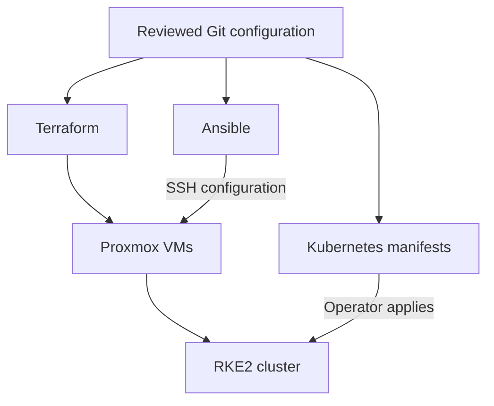

# Architecture

Barou Platform is a DevOps learning environment on Proxmox VE. This document separates the implemented platform from the GitLab migration and later GitOps and observability work.

## Hardware and Availability

| Component | Current configuration |
|---|---|
| Host | HP EliteDesk 800 G5 Mini |
| CPU | Intel Core i5-9500T |
| RAM | 16 GB |
| Storage | 256 GB SSD |
| Hypervisor | Proxmox VE, node `pve` |

All VMs depend on one physical host. Kubernetes has one control-plane/etcd node and one worker; the management gateway is also a single instance. This is a learning platform without production high availability.

## Current Platform

| Layer | Implemented components | Responsibility |
|---|---|---|
| Source and review | GitHub, pull requests and rulesets | Public repository and change review |
| Static CI | GitHub Actions and Azure Pipelines | Shared Terraform and Ansible validation |
| Administration | `ubuntu-dev-01`, VS Code Remote SSH | Run Git, Terraform, Ansible and kubectl |
| Infrastructure | Proxmox VE and Terraform | VM lifecycle, resources and Cloud-Init |
| Host configuration | Ansible roles | OS baseline, firewall, DNS, proxy and RKE2 |
| Private access | Tailscale, dnsmasq and Caddy on `mgmt-01` | Remote routing, internal DNS and HTTPS |
| Kubernetes | RKE2, containerd, Cilium, CoreDNS and ingress-nginx | Cluster runtime and application routing |
| Cluster management | Rancher | Kubernetes management |
| Visibility | Homepage and Metrics Server | Read-only dashboard and resource metrics |
| Azure foundation | Separate Azure Terraform roots and verification pipeline | Azure state and workload identity development |

Gitea and Jenkins were earlier Docker Compose learning services. Their VMs, deployment roles, inventory entries, DNS records, reverse-proxy routes and Homepage integrations have been retired. Existing screenshots and Git history may still contain those earlier milestones.

## Management Boundaries

Terraform defines the Proxmox VMs in `infrastructure/proxmox/variables.tf`, using `modules/ubuntu-vm`. It clones the Ubuntu Cloud-Init template, sets CPU and memory, connects the virtual NIC, configures initialization and enables the guest agent.

Ansible configures the guest operating systems through SSH. Kubernetes node configuration and workload manifests are separate: Ansible manages RKE2; `kubectl` applies platform manifests. Current static CI performs validation, not those deployment operations.

Proxmox state is local and excluded from Git. Azure state uses a separate Azure Storage backend. Azure environment isolation work must be checked independently; a successful development verification does not prove production access controls or cleanup are complete.

## Network Design

The LAN is `192.168.178.0/24`, with gateway `192.168.178.1` and Proxmox bridge `vmbr0`.

| Host | LAN address | Role |
|---|---|---|
| `pve` | `192.168.178.10` | Hypervisor/API |
| `ubuntu-dev-01` | `192.168.178.101` | Administration source |
| `ubuntu-tf-01` | Inventory target `192.168.178.103` | Ubuntu automation target; Terraform still uses DHCP |
| `mgmt-01` | Static `192.168.178.106` | DNS, proxy and subnet router |
| `k8s-cp-01` | Static `192.168.178.110` | Kubernetes API and control plane |
| `k8s-worker-01` | Static `192.168.178.111` | Worker and ingress endpoint |

Tailscale provides remote connectivity. Internal DNS sends application clients to `mgmt-01`. Caddy routes Proxmox requests to `.10:8006`, and Rancher and Homepage requests to `.111:80`, where ingress selects the application by hostname.

CoreDNS resolves cluster services and forwards the internal lab zone to `.106`. Public queries go to `1.1.1.1` and `9.9.9.9`.

The Kubernetes API firewall explicitly allows the administration sources `.101` and `.102`. The current development VM uses `.101`; `.102` remains a separately configured allowed source. Network reachability, TCP access, TLS and Kubernetes authorization are distinct checks.

## GitLab Migration

GitLab and GitLab Runner are planned replacements for the retired Git hosting and CI services. Neither is currently deployed. GitHub remains the public source and review platform while the new workflow is designed and verified.

The migration must keep Kubernetes and all remaining lab services running. Retiring the 2 GiB Gitea VM and 3 GiB Jenkins VM removes 5 GiB of configured guest allocation; this is not a measurement of available host memory or proof that GitLab fits.

Before provisioning, measure host memory, CPU and storage with the remaining workloads running. Account for GitLab, runner jobs, the host and operational headroom. Consult the selected release's [GitLab installation requirements](https://docs.gitlab.com/install/requirements/). The hosting location and final resource allocation remain open until that budget is established.

The implementation sequence is:

1. Finish and review the retirement changes and documentation.
2. Establish GitLab and Runner placement, resources, addressing, TLS and backups.
3. Run the existing validation script from GitLab CI/CD without deployment credentials.
4. Verify repository synchronization and branch protection before changing the review workflow.
5. Add controlled deployment jobs only after state, identity, runner isolation and approval requirements are implemented.

Azure workload identity and state isolation are separate workstreams. Moving a YAML pipeline alone does not move its authentication or authorization configuration.

## Future Platform Layers

| Planned component | Intended role | Dependency |
|---|---|---|
| Argo CD | Reconcile Kubernetes applications from Git | Repository access and deployment ownership |
| Prometheus | Collect metrics and support alerting | Capacity and storage |
| Grafana | Visualize metrics and logs | Data sources and access policy |
| Loki | Aggregate logs | Capacity, storage and retention |
| Persistent storage and off-host backups | Protect application data and recover the cluster | Tested storage and restore procedures |
| Additional nodes or hardware | Increase capacity and reduce failure impact | Resource and availability requirements |

Rancher manages clusters; Argo CD is intended to manage workload delivery. Homepage provides visibility and does not replace monitoring or alerting. None of these planned layers should be described as deployed before verification.

## Engineering and Security Principles

Changes should be small, versioned and reviewable. Infrastructure plans are reviewed before apply; Ansible changes are previewed where supported. Code validation is kept separate from live deployment.

Secrets and Terraform state stay outside Git. Integrations receive scoped credentials. SSH host verification remains enabled. Tailscale and host firewalls control access; HTTPS provides internal application transport. Existing Proxmox certificate-verification exceptions are documented in the infrastructure and proxy documentation.

Further work includes external secret management, credential rotation, backup/restore exercises, network policy and dependency updates. The platform is developed incrementally, with resource usage and failure behavior checked at each step.

See [Infrastructure Overview](infrastructure-overview.md), [Management Platform](management-platform.md), [Kubernetes Platform](architecture/kubernetes-platform.md) and [CI/CD Architecture](ci-cd.md) for operational details.
