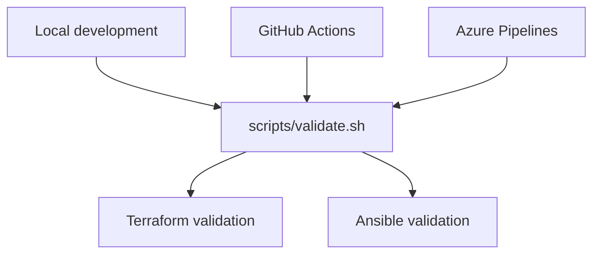

# CI/CD Architecture

## Overview

Barou Platform uses multiple CI systems to validate the same infrastructure repository.

GitHub remains the public source of truth. GitHub Actions provides the primary pull-request checks, while Azure Pipelines provides enterprise-oriented pipeline experience and a foundation for future Azure deployments.

Local development, GitHub Actions and Azure Pipelines reuse the same validation script.



## Platforms

| Platform | Purpose |
|---|---|
| Local shell | Fast validation before committing |
| GitHub Actions | Public pull-request and main-branch validation |
| Azure Pipelines | Enterprise CI and future Azure deployment foundation |
| Jenkins | Self-hosted CI/CD learning and homelab automation |

The systems currently validate code only. Azure Pipelines does not yet deploy infrastructure.

## Tool Versions

The CI environments use fixed tool versions to make validation reproducible.

| Tool | Version |
|---|---:|
| Terraform | `1.15.8` |
| Python | `3.12` |
| ansible-core | `2.21.2` |
| ansible-lint | `26.6.0` |
| community.general | `13.2.0` |
| community.docker | `5.2.2` |
| ansible.posix | `2.2.2` |

Terraform configuration accepts Terraform `1.15.x` through:

```hcl
required_version = "~> 1.15.0"
```

Tool upgrades are performed as separate changes so that compatibility problems can be identified independently from pipeline changes.

## Shared Validation Script

The central validation entry point is:

```text
scripts/validate.sh
```

Supported targets:

```bash
./scripts/validate.sh terraform
./scripts/validate.sh ansible
./scripts/validate.sh all
```

Running the script without an argument is equivalent to:

```bash
./scripts/validate.sh all
```

The Git alias below also runs all validations:

```bash
git validate
```

### Terraform validation

The Terraform target performs:

1. tool availability check;
2. recursive formatting validation;
3. initialization without the configured backend;
4. configuration validation.

The backend is disabled during CI:

```text
-backend=false
```

This prevents validation jobs from accessing or modifying Terraform state.

### Ansible validation

The Ansible target performs:

1. tool availability check;
2. syntax validation of `playbooks/bootstrap.yml`;
3. repository-wide ansible-lint validation.

The validation does not connect to managed hosts and does not apply configuration.

## GitHub Actions

Workflow:

```text
.github/workflows/ci.yml
```

Triggers:

- pull requests targeting `main`;
- pushes to `main`.

Jobs:

- Terraform validation;
- Ansible validation.

The workflow has read-only repository permissions:

```yaml
permissions:
  contents: read
```

No infrastructure credentials are provided to the workflow.

## Azure Pipelines

Pipeline definition:

```text
azure-pipelines.yml
```

Azure DevOps configuration:

| Property | Value |
|---|---|
| Organization | `BarouPlatform` |
| Project | `Platform Engineering` |
| Repository | `MoustafaBarou/barou-platform` |
| Agent | Microsoft-hosted `ubuntu-latest` |
| Pipeline type | YAML |
| Current scope | Validation only |

The pipeline contains one validation stage with two parallel jobs:

- Terraform validation;
- Ansible validation.

### Terraform job

The Terraform job:

1. checks out the GitHub repository;
2. installs Terraform `1.15.8`;
3. runs `scripts/validate.sh terraform`.

Terraform is installed through `TerraformInstaller@1` from the Microsoft DevLabs Terraform extension.

### Ansible job

The Ansible job:

1. checks out the GitHub repository;
2. activates Python `3.12`;
3. installs pinned Python development tools;
4. installs pinned Ansible collections;
5. runs `scripts/validate.sh ansible`.

Python tooling is defined in:

```text
configuration/ansible/requirements-ci.txt
```

Ansible collections are defined in:

```text
configuration/ansible/requirements.yml
```

## Security Model

The CI implementation follows these controls:

- no credentials are committed to Git;
- no Personal Access Token is stored in the repository;
- Azure Pipelines has access only to the required GitHub repository;
- CI jobs use clean, temporary Microsoft-hosted agents;
- repository checkout is cleaned before each job;
- Terraform state access is disabled during validation;
- validation jobs cannot apply Terraform changes;
- validation jobs do not run Ansible against managed hosts;
- Azure subscription access is not configured during the CI phase;
- tool and collection versions are pinned.

## Local Validation

Run all validations before committing:

```bash
git validate
```

Run the targets separately when troubleshooting:

```bash
./scripts/validate.sh terraform
./scripts/validate.sh ansible
```

Check shell syntax:

```bash
bash -n scripts/validate.sh
```

Check repository whitespace:

```bash
git diff --check
```

## Azure Pipeline Operations

Open the pipeline through:

```text
Azure DevOps
  -> Platform Engineering
  -> Pipelines
  -> Pipelines
```

A successful run must show:

- stage `Validate infrastructure code` succeeded;
- job `Terraform validation` succeeded;
- job `Ansible validation` succeeded;
- no step completed with issues.

Open an individual job to inspect installation and validation logs.

## Troubleshooting

### TerraformInstaller task is unavailable

Confirm that the Microsoft DevLabs Terraform extension is installed for the `BarouPlatform` Azure DevOps organization.

The pipeline requires:

```text
TerraformInstaller@1
```

### Terraform version is rejected

Compare:

- `terraformVersion` in `azure-pipelines.yml`;
- `TERRAFORM_VERSION` in `.github/workflows/ci.yml`;
- `required_version` in the Terraform modules.

The pipeline version must satisfy the Terraform configuration constraint.

### Ansible dependency installation fails

Check:

```text
configuration/ansible/requirements-ci.txt
configuration/ansible/requirements.yml
```

Confirm that the pinned package and collection versions still exist and support Python `3.12`.

### Local validation succeeds but CI fails

Compare the versions printed in the pipeline logs with the versions documented in this file.

Also check:

- operating-system differences;
- missing environment variables;
- uncommitted local files;
- dependencies available locally but missing from requirements files;
- case-sensitive paths on Linux agents.

### Pipeline does not start for a pull request

Confirm that:

- the pull request targets `main`;
- Azure Pipelines still has GitHub repository access;
- the pipeline points to `/azure-pipelines.yml`;
- PR triggers are enabled;
- the YAML file exists in the source branch.

## Planned CD Evolution

Future phases will extend Azure Pipelines with:

1. workload identity federation;
2. an Azure Resource Manager service connection;
3. remote Terraform state in Azure Storage;
4. Terraform plan artifacts;
5. protected Azure DevOps environments;
6. manual approval before apply;
7. deployment only from `main`;
8. separate development and production environments;
9. least-privilege Azure RBAC;
10. a self-hosted agent for private homelab deployment targets.

Terraform apply is intentionally excluded until authentication, state management, approval controls and recovery procedures are in place.
