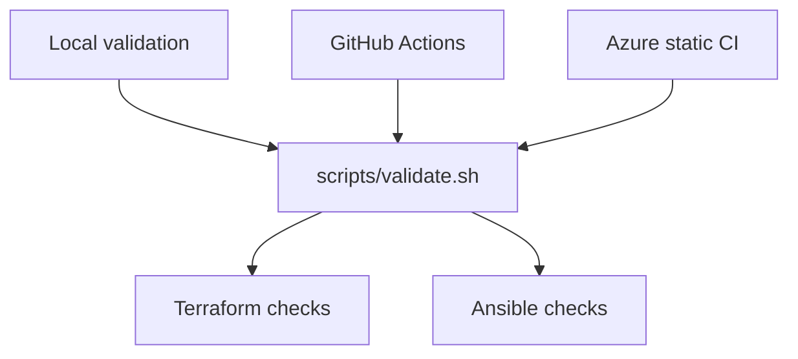

# CI/CD Architecture

GitHub remains the public source repository and review platform. GitHub Actions and the root Azure pipeline validate infrastructure code. A separate Azure pipeline verifies workload identity access. GitLab and GitLab Runner are planned; Jenkins has been retired.

## Current and Planned Responsibilities

| System | Status | Responsibility |
|---|---|---|
| Local shell on `ubuntu-dev-01` | In use | Validation and explicit operator deployment |
| GitHub Actions | In use | Pull-request and main-branch validation |
| `azure-pipelines.yml` | In use | Azure DevOps static CI using the same script |
| Azure WIF verification pipeline | Development verification has succeeded | Authenticate to Azure and verify backend/access configuration |
| GitLab CI/CD | Planned | Future GitLab pipeline orchestration |
| GitLab Runner | Planned | Execute future GitLab jobs |
| Jenkins | Retired | Historical learning service; no active deployment target |

Static validation and authenticated access verification are separate workflows. The latter is not evidence that an automated Terraform apply pipeline has been implemented.

## Shared Validation Script

From the repository root:

```bash
./scripts/validate.sh terraform
./scripts/validate.sh ansible
./scripts/validate.sh all
```

Running without a target also selects all checks. The configured `git validate` alias invokes the shared validation workflow.

Terraform checks cover formatting, initialization with `-backend=false`, and configuration validation. Backend initialization is disabled for this workflow; provider initialization is still required. These checks do not replace an authenticated plan against live infrastructure.

Ansible checks include the bootstrap playbook syntax and ansible-lint. They do not SSH to the managed hosts or apply configuration. Syntax-check a changed operational playbook explicitly when it is outside the script's direct syntax-check target.



## Tool Versions

The documented CI baseline is:

| Tool | Version |
|---|---|
| Terraform | `1.15.8` |
| Python | `3.12` |
| ansible-core | `2.21.2` |
| ansible-lint | `26.6.0` |
| community.general | `13.2.0` |
| community.docker | `5.2.2` |
| ansible.posix | `2.2.2` |

The workflow YAML and pinned requirement files are authoritative if a later upgrade changes this table. Compare `.github/workflows/ci.yml`, `azure-pipelines.yml`, `configuration/ansible/requirements-ci.txt` and `configuration/ansible/requirements.yml` when diagnosing version differences.

The Proxmox configuration accepts Terraform `~> 1.15.0`. Tool upgrades should be separate, reviewable changes.

## GitHub Actions

`.github/workflows/ci.yml` runs Terraform and Ansible validation for pull requests targeting `main` and pushes to `main`. It uses read-only repository permissions and receives no Proxmox deployment credentials.

Terraform and Ansible checks form the repository's existing quality gates. Confirm the checks required by the current ruleset; a message saying no checks were reported is not a successful validation result.

## Azure Static CI

| Setting | Value |
|---|---|
| Organization | `BarouPlatform` |
| Project | `Platform Engineering` |
| Repository | `MoustafaBarou/barou-platform` |
| Definition | `azure-pipelines.yml` |
| Agent | Microsoft-hosted `ubuntu-latest` |
| Scope | Static validation |

The pipeline runs parallel Terraform and Ansible jobs. Terraform installation uses `TerraformInstaller@1` from the Microsoft DevLabs Terraform extension. The Ansible job installs the pinned Python tools and collections before invoking the shared script.

The root pipeline does not apply infrastructure or configure homelab hosts. Keep it distinct from the workload identity verification pipeline when selecting a definition or examining logs.

To inspect definitions from the CLI:

```bash
az pipelines list \
  --organization https://dev.azure.com/BarouPlatform \
  --project "Platform Engineering" \
  --query "[].{Id:id,Name:name}" \
  --output table
```

Use the returned ID with `az pipelines show --id <id>` and inspect `process.yamlFilename` before queueing a run. Supply the organization and project options unless defaults are already configured.

## Azure Workload Identity Verification

The separate `pipelines/verification/azure-wif-dev.yml` pipeline uses the development service connection to authenticate, check the development deployment boundary, access development Terraform state and validate backend initialization.

The state-isolation branch also checks that production state access is denied. The development verification succeeded after its error handling recognized Azure CLI's permission-denied wording as well as the storage authorization code. An unexpected request failure must not be counted as a successful isolation check.

This is recorded evidence of development verification, not a claim that the state-isolation branch has been merged or that all cleanup is complete. Production identity verification and removal of the old shared-container permissions require their own evidence. Azure state migration and access-control cleanup remain separate from the GitLab migration.

## GitLab CI/CD Migration

GitLab is the selected replacement direction for Gitea and Jenkins. The GitLab server/hosting arrangement, Runner placement and resource budget are not finalized. No working GitLab pipeline is claimed by this documentation.

The migration sequence is:

1. Review the retirement changes and keep existing CI passing.
2. Establish GitLab access, TLS, repository ownership, backups and Runner capacity without stopping Kubernetes or the remaining services.
3. Create a validation-only GitLab pipeline that reuses `scripts/validate.sh` and the pinned dependencies.
4. Verify both successful checks and a deliberately failing validation before depending on the new pipeline.
5. Define synchronization and review policy while GitHub remains the public repository.
6. Introduce infrastructure-aware jobs only after runner isolation, credentials, state locking and approval controls are ready.

GitLab Runner executes jobs; it is a separate component from the GitLab application and has its own resource and access requirements. Plan for job concurrency and build load, not only idle service memory. Use the selected release's [installation requirements](https://docs.gitlab.com/install/requirements/) when evaluating self-hosting.

Azure federation is configured for its issuer, audience and subject. Do not assume the existing Azure DevOps service connection can simply be reused by GitLab jobs; that identity integration needs a separate design and verification.

## Security and Deployment Boundaries

- Keep credentials, state, private variable files and kubeconfigs outside Git.
- Keep static validation jobs free of deployment credentials.
- Restrict future runners with infrastructure access to trusted code and explicit environments.
- Review Terraform plans and protect deployment artifacts as potentially sensitive.
- Preserve environment separation and verify denied access explicitly.
- Keep Kubernetes and management services running during the migration.

Proxmox Terraform state is currently local. Azure has its own remote-state configuration. A future homelab deployment runner needs a deliberate state and locking solution; it must not operate from an unrelated copy of local state.

## Local Checks and Troubleshooting

```bash
cd ~/terraform/barou-platform
./scripts/validate.sh all
bash -n scripts/validate.sh
git --no-pager diff --check
```

| Failure | Investigate |
|---|---|
| TerraformInstaller task unavailable | Azure DevOps extension availability |
| Terraform version rejected | Workflow version versus root/module constraints |
| Ansible dependency failure | Pinned requirements, collection availability and Python compatibility |
| Local pass, CI fail | Uncommitted files, tool versions, environment dependencies and Linux path case |
| No PR checks reported | Trigger, target branch, workflow path and repository integration |
| Authenticated Azure verification fails | Failing task logs, identity, scope and backend settings |

A successful static CI run verifies code quality within its checks. Live plans, connectivity tests and application checks provide different evidence and should be recorded separately.
