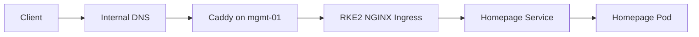

# Homepage Platform Dashboard

## Overview

Homepage is the central read-only dashboard for the Barou Platform homelab.

It runs inside the RKE2 Kubernetes cluster and combines operational information from Kubernetes, Proxmox VE, Gitea and Jenkins.

| Property | Value |
|---|---|
| URL | `https://platform.lab.barouconsulting.nl` |
| Namespace | `homepage` |
| Deployment | `homepage` |
| Container image | `ghcr.io/gethomepage/homepage:v1.13.2` |
| Kubernetes node | `k8s-worker-01` |
| Service type | `ClusterIP` |
| Ingress class | `nginx` |

Homepage provides visibility into the platform. Administrative actions remain available through the management interfaces of the connected services.

## Traffic Flow



Internal DNS resolves `platform.lab.barouconsulting.nl` to `mgmt-01` at `192.168.178.106`.

Caddy terminates HTTPS and forwards traffic to the RKE2 ingress endpoint at `192.168.178.111:80`.

The Kubernetes Service forwards traffic to the Homepage container on port `3000`.

## Repository Structure

| File | Purpose |
|---|---|
| `namespace.yaml` | Creates the `homepage` namespace |
| `service-account.yaml` | Creates the Homepage ServiceAccount |
| `rbac.yaml` | Grants read-only Kubernetes permissions |
| `configmap.yaml` | Stores the Homepage configuration |
| `deployment.yaml` | Runs Homepage and injects Secret references |
| `service.yaml` | Exposes Homepage inside the cluster |
| `ingress.yaml` | Routes the platform hostname to Homepage |
| `README.md` | Documents the deployment and operations |

The manifests are applied individually. This directory does not currently use Helm or Kustomize.

## Integrations

### Kubernetes

Homepage uses the `homepage` ServiceAccount and the permissions defined in `rbac.yaml`.

The dashboard displays:

- cluster CPU usage;
- cluster memory usage;
- control-plane node usage;
- worker node usage;
- selected Kubernetes workload information.

### Proxmox VE

| Property | Value |
|---|---|
| API URL | `https://192.168.178.10:8006` |
| Dashboard URL | `https://proxmox.lab.barouconsulting.nl` |
| Service account | `homepage@pve` |
| API token ID | `homepage@pve!homepage` |
| Permission | `PVEAuditor` on `/` |
| Kubernetes Secret | `homepage-proxmox` |

Required Secret keys:

- `token-id`
- `token-secret`

The widget displays VM count, LXC count, CPU usage and memory usage.

### Gitea

| Property | Value |
|---|---|
| API URL | `http://192.168.178.104:3000` |
| Dashboard URL | `https://gitea.lab.barouconsulting.nl` |
| Kubernetes Secret | `homepage-gitea` |
| Required key | `api-token` |

The token is injected as:

```text
HOMEPAGE_VAR_GITEA_API_TOKEN
```

The widget displays repositories, notifications, issues and pull requests.

### Jenkins

| Property | Value |
|---|---|
| API URL | `http://192.168.178.105:8080` |
| Dashboard URL | `https://jenkins.lab.barouconsulting.nl` |
| API account | `homepage` |
| Kubernetes Secret | `homepage-jenkins` |
| Monitored job | `platform-ci-demo` |

The Jenkins account has the following Matrix Authorization permissions:

- `Overall/Read`
- `Job/Read`
- `View/Read`

The account does not have Jenkins administration permissions.

Required Secret keys:

- `username`
- `api-token`

The values are injected as:

```text
HOMEPAGE_VAR_JENKINS_USERNAME
HOMEPAGE_VAR_JENKINS_API_TOKEN
```

Homepage uses its `customapi` widget to display:

- job name;
- latest build result;
- latest build number;
- whether a build is currently running.

## Secret Management

Credentials are stored in Kubernetes Secrets and are not committed to Git.

| Secret | Required keys |
|---|---|
| `homepage-proxmox` | `token-id`, `token-secret` |
| `homepage-gitea` | `api-token` |
| `homepage-jenkins` | `username`, `api-token` |

Confirm that the Secrets exist:

```bash
kubectl -n homepage get secrets \
  homepage-proxmox \
  homepage-gitea \
  homepage-jenkins
```

Inspect Secret metadata and key sizes without decoding values:

```bash
kubectl -n homepage describe secret homepage-jenkins
```

Exported Secret manifests, decoded values, passwords and API tokens must not be stored in the repository.

## Deployment

Apply the resources in dependency order:

```bash
kubectl apply -f kubernetes/platform/homepage/namespace.yaml
kubectl apply -f kubernetes/platform/homepage/service-account.yaml
kubectl apply -f kubernetes/platform/homepage/rbac.yaml
kubectl apply -f kubernetes/platform/homepage/configmap.yaml
kubectl apply -f kubernetes/platform/homepage/deployment.yaml
kubectl apply -f kubernetes/platform/homepage/service.yaml
kubectl apply -f kubernetes/platform/homepage/ingress.yaml
```

Validate a manifest against the Kubernetes API without changing the cluster:

```bash
kubectl apply --dry-run=server \
  -f kubernetes/platform/homepage/configmap.yaml
```

Homepage configuration files are mounted from the ConfigMap using `subPath`. Restart the Deployment after changing the ConfigMap:

```bash
kubectl -n homepage rollout restart deployment/homepage

kubectl -n homepage rollout status \
  deployment/homepage \
  --timeout=120s
```

## Operations

Display the current state:

```bash
kubectl -n homepage get deployment,pods,service,ingress
```

Expected state:

- Deployment reports `1/1` ready;
- pod reports `1/1` ready and `Running`;
- restart count remains stable;
- Service exposes port `3000`;
- Ingress uses `platform.lab.barouconsulting.nl`.

Display the pod placement and IP address:

```bash
kubectl -n homepage get pods -o wide
```

The pod should run on `k8s-worker-01`.

Display recent logs:

```bash
kubectl -n homepage logs deployment/homepage \
  --tail=100 \
  --prefix
```

Follow logs in real time:

```bash
kubectl -n homepage logs deployment/homepage \
  --follow \
  --prefix
```

Stop following logs with `Ctrl+C`.

## Rollback

Display the Deployment history:

```bash
kubectl -n homepage rollout history deployment/homepage
```

Roll back the Deployment to its previous revision:

```bash
kubectl -n homepage rollout undo deployment/homepage

kubectl -n homepage rollout status \
  deployment/homepage \
  --timeout=120s
```

A Deployment rollback does not restore previous ConfigMap contents. ConfigMap changes must be restored from Git and applied again.

## Troubleshooting

### Dashboard unavailable

Check the resources:

```bash
kubectl -n homepage get deployment,pods,service,ingress
```

Confirm that the Service has a backend endpoint:

```bash
kubectl -n homepage get endpoints homepage
```

Check the logs:

```bash
kubectl -n homepage logs deployment/homepage \
  --tail=200 \
  --prefix
```

Check DNS resolution:

```bash
dig platform.lab.barouconsulting.nl
```

The expected address is `192.168.178.106`.

### Widget API error

Confirm that the required Secrets exist:

```bash
kubectl -n homepage get secrets
```

Display the Deployment's Secret references without showing Secret values:

```bash
kubectl -n homepage get deployment homepage \
  -o jsonpath='{range .spec.template.spec.containers[0].env[*]}{.name}{" -> "}{.valueFrom.secretKeyRef.name}{"/"}{.valueFrom.secretKeyRef.key}{"\n"}{end}'
```

Search recent logs for integration errors:

```bash
kubectl -n homepage logs deployment/homepage \
  --since=5m |
grep -iE 'error|unauthorized|forbidden|jenkins|gitea|proxmox' || true
```

### Kubernetes information unavailable

Confirm that the ServiceAccount exists:

```bash
kubectl -n homepage get serviceaccount homepage
```

Check whether the ServiceAccount can read Kubernetes nodes:

```bash
kubectl auth can-i get nodes \
  --as=system:serviceaccount:homepage:homepage
```

Expected result:

```text
yes
```

## Security Model

The deployment follows these controls:

- service credentials are stored in Kubernetes Secrets;
- Secret values are excluded from Git;
- Proxmox uses a dedicated read-only API account;
- Jenkins uses a dedicated read-only API account;
- Kubernetes access uses a dedicated ServiceAccount and RBAC;
- external HTTPS is terminated by Caddy;
- integrations use internal API addresses where possible;
- Homepage receives visibility permissions rather than administrative permissions.
